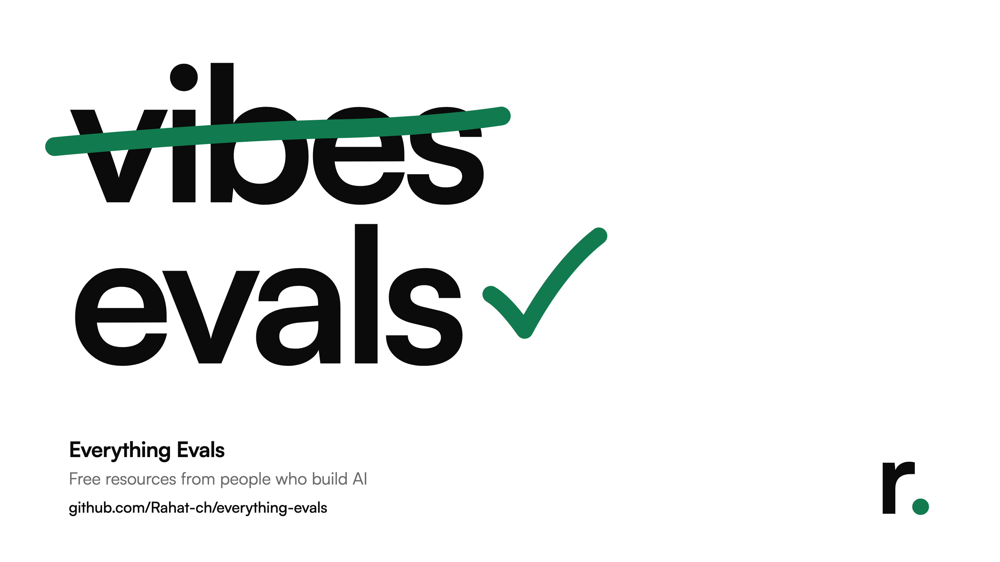

# Everything Evals

A reading list for learning how to evaluate LLM apps and agents properly. Everything on it is free and comes from people who do this work: practitioners who have shipped eval systems, AI lab teams, researchers, and standards bodies. No influencer content, no vendor marketing, nothing paywalled.

**→ [The full list: resources.md](resources.md)**: 57 resources in 13 categories, each with who wrote it, why they're credible, format, length and date. Every link was checked on 2026-10-03, and every linked resource was audited to confirm its author works in AI or is a researcher.

## Start here

Read these in order:

1. [Your AI Product Needs Evals](https://hamel.dev/blog/posts/evals/) by Hamel Husain
2. [A Field Guide to Rapidly Improving AI Products](https://hamel.dev/blog/posts/field-guide/) by Hamel Husain
3. [Using LLM-as-a-Judge For Evaluation: A Complete Guide](https://hamel.dev/blog/posts/llm-judge/) by Hamel Husain
4. [Who Validates the Validators?](https://arxiv.org/abs/2404.12272) by Shankar et al.
5. [A statistical approach to model evaluations](https://www.anthropic.com/research/statistical-approach-to-model-evals) by Anthropic
6. [Demystifying evals for AI agents](https://www.anthropic.com/engineering/demystifying-evals-for-ai-agents) by Anthropic
7. [CS336 Lecture 12: Evaluation](https://www.youtube.com/watch?v=x-R5l2HsXqM) by Percy Liang (Stanford)

## What's covered

- Foundations and methodology
- Error analysis and building evals for an app
- LLM-as-judge and its calibration
- Statistics and rigour
- Benchmarks, leaderboards and their pitfalls
- Agent evals
- Human labelling and agreement
- Online evals and experiments
- Frameworks and tools
- Lab guidance
- Safety, capability and government frameworks
- Courses and lectures
- Talks

## How it was put together

The list was compiled with web search. Each link was fetched to check that it resolves and is free. Credentials come from the authors' own pages, paper author lists and org pages. Things that were left out on purpose, things that couldn't be verified, and resources that overlap are all noted at the end of [resources.md](resources.md).

## Contributing

Know a good resource that fits? [Suggest it](../../issues/new?template=suggest-a-resource.yml), or open a pull request. The bar for what gets in, and the entry format, are in [CONTRIBUTING.md](CONTRIBUTING.md). Links rot and job titles change, so [reports of broken or outdated entries](../../issues/new?template=broken-or-outdated.yml) help too.

## License

[MIT](LICENSE) © 2026 Rahat Chowdhury. Each linked resource belongs to its own author, under its own terms.

---

